## 微信小程序之网易云音乐的实现-云音乐

### 基本介绍

* 基本功能都实现了,音乐的上一首下一首播放等,顺便把进度条的拖动播放写了下
* 主页的**每日推荐界面**写了 ,登录通过账号密码登录~(你也可以自己加一个验证码或者邮箱登录~)
* 基于iPhone6(375*667分辨率)开发,后面一些计算都是通过获取当前屏幕下的尺寸来计算的,但是不保证在其他分辨率下是否完好(我已经尽力了~)
* 下载地址
  * github地址: https://github.com/superBiuBiuMan/Wechat_NetEase_CloudMusic
  * gitee地址: https://gitee.com/superBiuBiu/Wechat_NetEase_CloudMusic 

* 网易云NodeJs服务器地址

  * http://cloudmusic.dreamlove.top:3000/

* 更改自己的API地址

  * 虽然目前我这服务器的可以用,但是服务器会有过期的一天
  * 项目使用  [@网易云音乐 NodeJS 版 API](https://neteasecloudmusicapi.vercel.app/#/)

  * 可以去[github地址](https://github.com/Binaryify/NeteaseCloudMusicApi)下载后台,然后安装依赖包并修改**/utils/config.js**文件

  * 如果是自己电脑搭建API服务器,将`host`配置项修改为如下,因为此API服务器默认使用3000端口(但需要注意的是,如果自己电脑不是公网ip,在手机上调试可能需要内网穿透)

    ```js
    export default {
    	host: 'http://localhost:3000',
    }
    ```

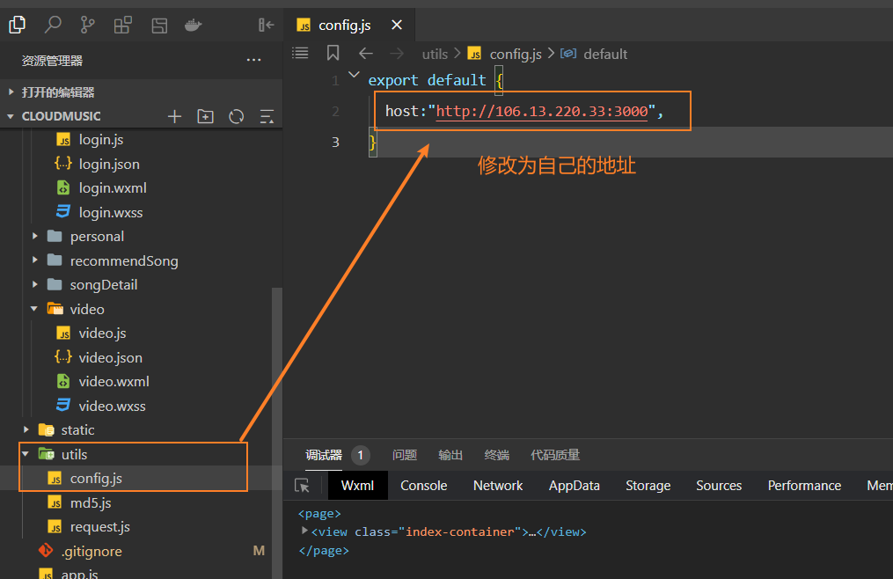

### 项目预览

#### 首页

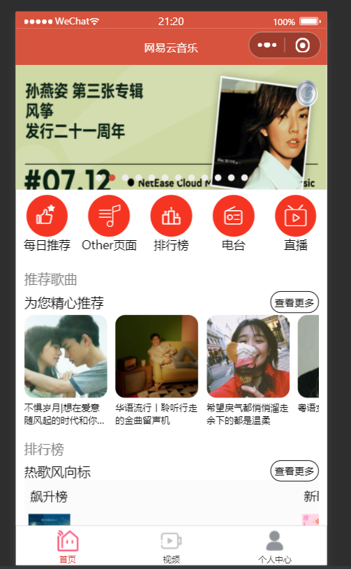

#### 视频

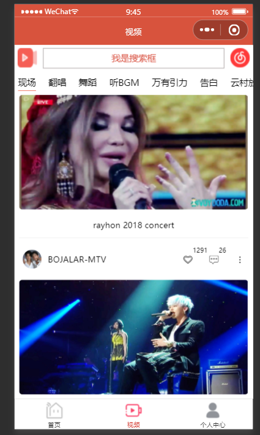

#### 搜索界面

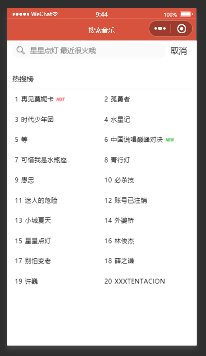

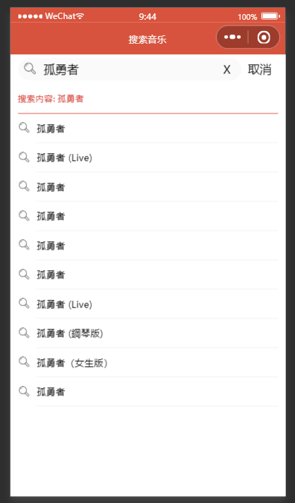

#### 每日推荐

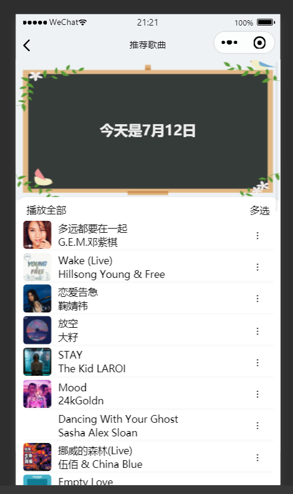

#### 个人中心

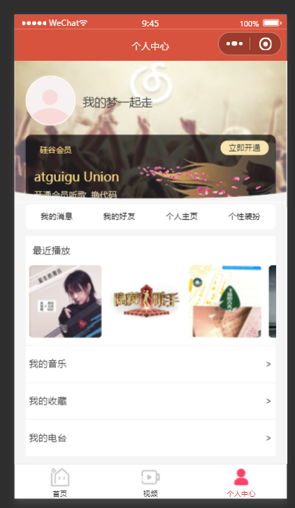

#### 登录界面

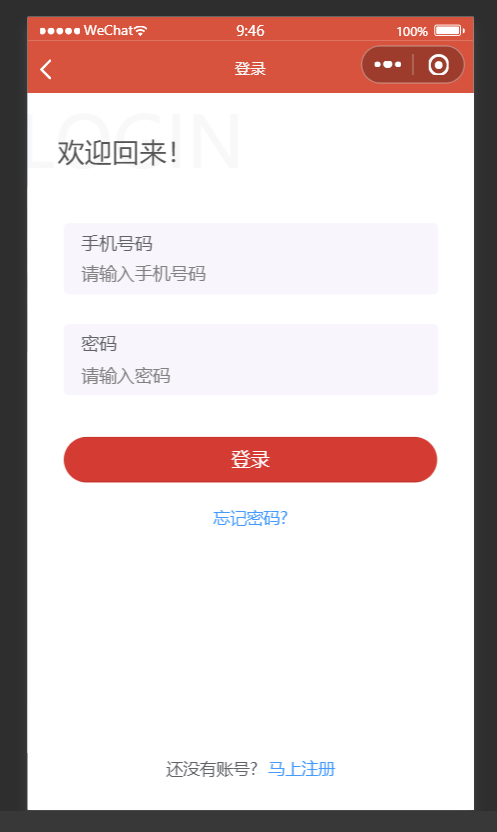

#### 播放音乐界面

* 动态图

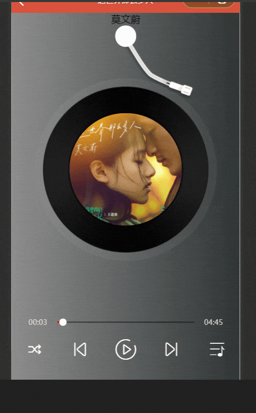

* 静态图


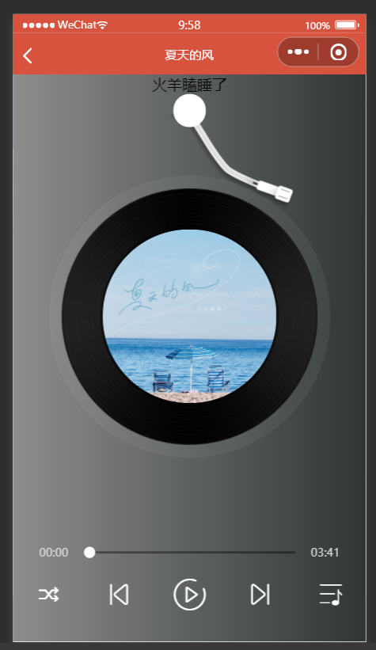

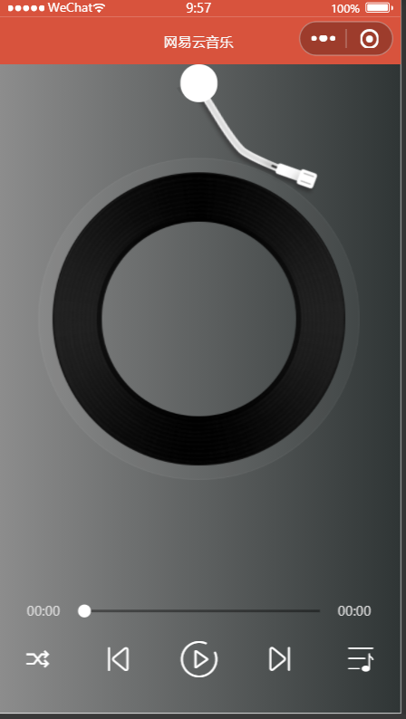